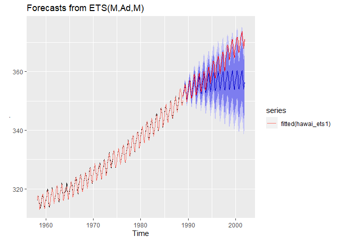
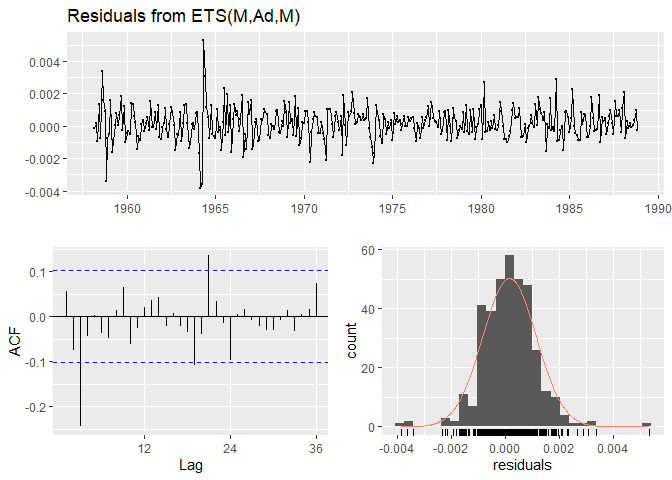
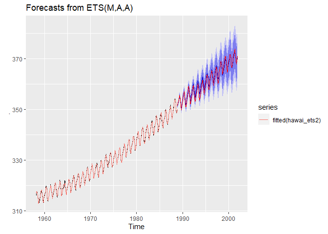
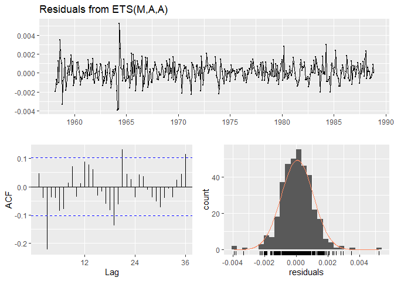

Livrable 5 - Séries temporelles et reproductibilité
================
Claudie-Maude Canuel
15 avril 2020

### 1. Activer les modules nécessaires

``` r
library("packrat")
```

    ## Warning: package 'packrat' was built under R version 3.6.3

``` r
library("lubridate")
```

    ## Warning: package 'lubridate' was built under R version 3.6.3

    ## 
    ## Attaching package: 'lubridate'

    ## The following objects are masked from 'package:base':
    ## 
    ##     date, intersect, setdiff, union

``` r
library("rmarkdown")
```

    ## Warning: package 'rmarkdown' was built under R version 3.6.3

``` r
library("tidyverse")
```

    ## Warning: package 'tidyverse' was built under R version 3.6.3

    ## -- Attaching packages ------------------------------------------------- tidyverse 1.3.0 --

    ## v ggplot2 3.3.0     v purrr   0.3.3
    ## v tibble  3.0.0     v dplyr   0.8.5
    ## v tidyr   1.0.2     v stringr 1.4.0
    ## v readr   1.3.1     v forcats 0.5.0

    ## Warning: package 'ggplot2' was built under R version 3.6.3

    ## Warning: package 'tibble' was built under R version 3.6.3

    ## Warning: package 'tidyr' was built under R version 3.6.3

    ## Warning: package 'readr' was built under R version 3.6.3

    ## Warning: package 'purrr' was built under R version 3.6.3

    ## Warning: package 'dplyr' was built under R version 3.6.3

    ## Warning: package 'stringr' was built under R version 3.6.3

    ## Warning: package 'forcats' was built under R version 3.6.3

    ## -- Conflicts ---------------------------------------------------- tidyverse_conflicts() --
    ## x lubridate::as.difftime() masks base::as.difftime()
    ## x lubridate::date()        masks base::date()
    ## x dplyr::filter()          masks stats::filter()
    ## x lubridate::intersect()   masks base::intersect()
    ## x dplyr::lag()             masks stats::lag()
    ## x lubridate::setdiff()     masks base::setdiff()
    ## x lubridate::union()       masks base::union()

``` r
library("forecast")
```

    ## Warning: package 'forecast' was built under R version 3.6.3

    ## Registered S3 method overwritten by 'quantmod':
    ##   method            from
    ##   as.zoo.data.frame zoo

``` r
library("e1071")
```

    ## Warning: package 'e1071' was built under R version 3.6.3

### 2. Importer le tableau de données

``` r
hawai <- read.csv("Data/hawai.csv") # Importer le tableau
hawai %>% head(10) # Visualiser les 10 premières lignes et l'entête
```

    ##        time      CO2
    ## 1  1958.167 316.1000
    ## 2  1958.250 317.2000
    ## 3  1958.333 317.4333
    ## 4  1958.417 317.4333
    ## 5  1958.500 315.6250
    ## 6  1958.583 314.9500
    ## 7  1958.667 313.5000
    ## 8  1958.750 313.5000
    ## 9  1958.833 313.4250
    ## 10 1958.917 314.7000

``` r
dim(hawai) # Visualiser les dimensions de la matrice: il y a 526 observations
```

    ## [1] 526   2

``` r
summary(hawai) # Visualiser rapidement l'étendu des données
```

    ##       time           CO2       
    ##  Min.   :1958   Min.   :313.4  
    ##  1st Qu.:1969   1st Qu.:324.0  
    ##  Median :1980   Median :337.9  
    ##  Mean   :1980   Mean   :339.6  
    ##  3rd Qu.:1991   3rd Qu.:354.5  
    ##  Max.   :2002   Max.   :373.8

### 3. Créer une série temporelle du CO<sup>2</sup>

``` r
# Générer une série temporelle
hawai_ts <- ts(hawai %>%
    dplyr::select(CO2),
    start = c(1958, 3), # Débuter en mars 1958
    frequency = 12)
hawai_ts # Visualiser la série temporelle de mars 1958 à décembre 2001
```

    ##           Jan      Feb      Mar      Apr      May      Jun      Jul      Aug
    ## 1958                   316.1000 317.2000 317.4333 317.4333 315.6250 314.9500
    ## 1959 315.5000 316.7000 316.7333 317.6750 318.3250 318.0250 316.5250 314.9000
    ## 1960 316.3800 316.9750 317.5750 319.1200 319.9250 319.4500 318.0600 315.7750
    ## 1961 316.9250 317.6500 318.5250 319.4200 320.4750 319.7500 318.3200 316.7750
    ## 1962 317.9250 318.6250 319.6800 320.5500 320.9000 320.5000 319.4250 317.7333
    ## 1963 318.7250 318.9667 319.8600 321.2750 322.1000 321.4600 319.6000 317.6000
    ## 1964 319.4000 319.4000 319.1000 319.4000 322.0000 321.7500 320.3000 318.5000
    ## 1965 319.4000 320.4500 320.9250 322.0000 322.0600 321.7750 321.0400 318.7250
    ## 1966 320.5400 321.5750 322.3750 323.6600 324.0250 323.7000 322.8500 320.2000
    ## 1967 322.4000 322.4250 323.0000 324.2800 324.9500 324.0750 322.4800 320.8500
    ## 1968 322.5500 323.0500 323.9200 324.9750 325.4750 325.2600 324.0250 321.9400
    ## 1969 323.9250 324.2750 325.6000 326.5750 327.2800 326.5500 325.8000 323.5400
    ## 1970 325.0800 326.0250 327.0000 328.0750 327.9200 327.5500 326.3000 324.6600
    ## 1971 326.1400 326.6500 327.2000 327.6750 328.8200 328.4750 327.2200 325.2500
    ## 1972 326.7200 327.6250 327.7250 329.6400 330.0000 329.0750 328.0400 326.2500
    ## 1973 328.5500 329.4750 330.3800 331.5750 332.4000 331.9400 330.6500 329.3250
    ## 1974 329.3250 330.6250 331.5000 332.6250 332.9750 332.1600 331.0750 329.2200
    ## 1975 330.2500 331.3000 332.0000 333.2750 333.8600 333.4000 331.8000 329.9800
    ## 1976 331.7400 332.5500 333.4500 334.4500 334.7600 334.4000 332.8600 330.7250
    ## 1977 332.8800 333.4250 334.7000 336.0400 336.6750 336.2000 334.8000 332.8750
    ## 1978 335.0250 335.3500 336.6000 337.6400 337.9500 337.9250 336.5000 334.6500
    ## 1979 336.2250 336.7000 338.0000 338.8750 339.3750 339.2400 337.5250 336.0250
    ## 1980 337.9250 338.2250 340.0600 340.7500 341.3400 340.9500 339.3750 337.6000
    ## 1981 339.2200 340.4500 341.4000 342.4500 342.8200 342.1250 340.4250 338.4000
    ## 1982 340.7000 341.5500 342.6750 343.4750 343.9600 343.3000 341.9200 339.6250
    ## 1983 341.3400 342.5000 343.1500 344.9000 345.6500 345.2750 343.8200 342.1500
    ## 1984 343.6750 344.4250 345.1750 347.4000 347.3500 346.6600 345.2000 343.3000
    ## 1985 344.9250 345.8750 347.4400 348.3250 348.8250 348.1800 346.4500 344.3000
    ## 1986 346.2500 346.8250 347.7400 349.5250 350.0800 349.3750 347.8250 345.8200
    ## 1987 348.0000 348.5000 349.4750 350.8500 351.7400 351.1500 349.4500 348.0800
    ## 1988 350.4000 351.7750 352.1250 353.5800 354.1750 353.7500 352.2200 350.3000
    ## 1989 352.7750 353.0000 353.6000 355.3600 355.6000 355.1250 353.8600 351.5750
    ## 1990 353.6500 354.6500 355.4800 356.1750 357.0750 356.0800 354.6750 352.9000
    ## 1991 354.6750 355.6500 357.2000 358.6000 359.2500 358.1800 356.0500 353.8600
    ## 1992 355.9000 356.6800 357.9000 359.0750 359.5400 359.1250 357.0000 354.8600
    ## 1993 356.6800 357.1750 358.4250 359.3250 360.1800 359.5000 357.4200 355.3250
    ## 1994 358.3200 358.9000 359.9250 361.2200 361.6500 360.9000 359.4600 357.3750
    ## 1995 359.9750 360.9250 361.5750 363.3600 363.7000 363.2500 361.8000 359.3750
    ## 1996 362.0250 363.1750 364.0600 364.7000 365.3250 364.8800 363.4750 361.3200
    ## 1997 363.1250 363.8750 364.5600 366.3250 366.6800 365.4750 364.3750 362.4600
    ## 1998 365.3400 366.2000 367.3750 368.5250 369.1400 368.7500 367.6000 365.7200
    ## 1999 368.1200 368.8500 369.6000 370.9750 370.8400 370.2500 369.0000 366.7000
    ## 2000 369.0200 369.3750 370.4000 371.5400 371.6500 371.6250 369.9400 367.9500
    ## 2001 370.1750 371.3250 372.0600 372.7750 373.8000 373.0600 371.3000 369.4250
    ##           Sep      Oct      Nov      Dec
    ## 1958 313.5000 313.5000 313.4250 314.7000
    ## 1959 313.8250 313.4000 314.8750 315.5250
    ## 1960 314.1750 313.8400 315.0250 316.2000
    ## 1961 315.0400 315.3500 316.0500 316.9800
    ## 1962 316.0667 315.4750 316.5500 317.5250
    ## 1963 316.1500 316.0500 317.0000 318.3500
    ## 1964 316.6000 316.9600 317.7250 318.6750
    ## 1965 317.8250 317.3400 318.8750 319.3250
    ## 1966 318.7000 318.1800 319.9000 321.0600
    ## 1967 319.3000 319.4500 320.6750 321.9200
    ## 1968 320.2500 320.2750 321.3200 322.9250
    ## 1969 322.4000 321.8000 322.8200 324.1250
    ## 1970 323.1500 323.1400 324.0500 325.1000
    ## 1971 323.4000 323.5400 324.8250 325.9250
    ## 1972 324.8600 325.3000 326.4250 327.5400
    ## 1973 327.5000 327.2250 328.0500 328.6400
    ## 1974 327.3750 327.3750 328.4000 329.6750
    ## 1975 328.5250 328.3250 329.4400 330.7750
    ## 1976 329.3500 329.1000 330.3500 331.6250
    ## 1977 331.5750 331.2000 332.3500 333.8600
    ## 1978 332.7400 332.6500 333.8250 334.9600
    ## 1979 333.9800 333.9500 335.1500 336.6600
    ## 1980 335.8750 336.0250 337.0600 338.2000
    ## 1981 336.7000 336.9400 338.4250 339.6000
    ## 1982 338.0250 337.9000 339.2750 340.4250
    ## 1983 339.8750 340.0200 341.1500 342.9800
    ## 1984 341.1200 341.4750 342.8500 344.1400
    ## 1985 343.0000 342.8000 344.2200 345.5750
    ## 1986 344.8000 344.1000 345.6200 346.8750
    ## 1987 346.4000 346.4400 347.9250 348.9250
    ## 1988 348.7500 348.9600 350.0000 351.3600
    ## 1989 349.8600 350.0500 351.2000 352.4800
    ## 1990 350.9400 351.2250 352.7000 354.1400
    ## 1991 352.1250 352.2500 353.7400 355.0250
    ## 1992 353.0250 353.4200 354.2000 355.3500
    ## 1993 353.7750 354.0600 355.3500 356.7750
    ## 1994 355.9250 356.0200 357.5750 359.0600
    ## 1995 358.0000 357.8500 359.4750 360.7000
    ## 1996 359.4000 359.6250 360.7400 362.3750
    ## 1997 360.1500 360.7500 362.3800 364.2500
    ## 1998 363.9250 364.3200 365.5500 366.9250
    ## 1999 364.6750 365.1400 366.6500 367.9000
    ## 2000 366.5400 366.7250 368.1250 369.4400
    ## 2001 367.8800 368.0500 369.3750 371.0200

### 4. Séparer la série temporelle en deux parties (entrainement et test)

La partie entrainement devra contenir les premiers 70% des données, soit les premières 368 données (70% x 526), c'est-à-dire les 30.667 premières années (368 mois/12 mois an<sup>-1</sup>) du jeu de données, correspondant au temps 1988.85. La partie test devra contenir le 30% des données restantes.

``` r
# Détermination de l'année de séparation
annee <- 1958.167 + (0.7*526/12)
annee # Visualiser
```

    ## [1] 1988.85

``` r
# Partie entrainement
hawai_ent <- hawai_ts %>%
      window(end = annee)
hawai_ent # Visualiser
```

    ##           Jan      Feb      Mar      Apr      May      Jun      Jul      Aug
    ## 1958                   316.1000 317.2000 317.4333 317.4333 315.6250 314.9500
    ## 1959 315.5000 316.7000 316.7333 317.6750 318.3250 318.0250 316.5250 314.9000
    ## 1960 316.3800 316.9750 317.5750 319.1200 319.9250 319.4500 318.0600 315.7750
    ## 1961 316.9250 317.6500 318.5250 319.4200 320.4750 319.7500 318.3200 316.7750
    ## 1962 317.9250 318.6250 319.6800 320.5500 320.9000 320.5000 319.4250 317.7333
    ## 1963 318.7250 318.9667 319.8600 321.2750 322.1000 321.4600 319.6000 317.6000
    ## 1964 319.4000 319.4000 319.1000 319.4000 322.0000 321.7500 320.3000 318.5000
    ## 1965 319.4000 320.4500 320.9250 322.0000 322.0600 321.7750 321.0400 318.7250
    ## 1966 320.5400 321.5750 322.3750 323.6600 324.0250 323.7000 322.8500 320.2000
    ## 1967 322.4000 322.4250 323.0000 324.2800 324.9500 324.0750 322.4800 320.8500
    ## 1968 322.5500 323.0500 323.9200 324.9750 325.4750 325.2600 324.0250 321.9400
    ## 1969 323.9250 324.2750 325.6000 326.5750 327.2800 326.5500 325.8000 323.5400
    ## 1970 325.0800 326.0250 327.0000 328.0750 327.9200 327.5500 326.3000 324.6600
    ## 1971 326.1400 326.6500 327.2000 327.6750 328.8200 328.4750 327.2200 325.2500
    ## 1972 326.7200 327.6250 327.7250 329.6400 330.0000 329.0750 328.0400 326.2500
    ## 1973 328.5500 329.4750 330.3800 331.5750 332.4000 331.9400 330.6500 329.3250
    ## 1974 329.3250 330.6250 331.5000 332.6250 332.9750 332.1600 331.0750 329.2200
    ## 1975 330.2500 331.3000 332.0000 333.2750 333.8600 333.4000 331.8000 329.9800
    ## 1976 331.7400 332.5500 333.4500 334.4500 334.7600 334.4000 332.8600 330.7250
    ## 1977 332.8800 333.4250 334.7000 336.0400 336.6750 336.2000 334.8000 332.8750
    ## 1978 335.0250 335.3500 336.6000 337.6400 337.9500 337.9250 336.5000 334.6500
    ## 1979 336.2250 336.7000 338.0000 338.8750 339.3750 339.2400 337.5250 336.0250
    ## 1980 337.9250 338.2250 340.0600 340.7500 341.3400 340.9500 339.3750 337.6000
    ## 1981 339.2200 340.4500 341.4000 342.4500 342.8200 342.1250 340.4250 338.4000
    ## 1982 340.7000 341.5500 342.6750 343.4750 343.9600 343.3000 341.9200 339.6250
    ## 1983 341.3400 342.5000 343.1500 344.9000 345.6500 345.2750 343.8200 342.1500
    ## 1984 343.6750 344.4250 345.1750 347.4000 347.3500 346.6600 345.2000 343.3000
    ## 1985 344.9250 345.8750 347.4400 348.3250 348.8250 348.1800 346.4500 344.3000
    ## 1986 346.2500 346.8250 347.7400 349.5250 350.0800 349.3750 347.8250 345.8200
    ## 1987 348.0000 348.5000 349.4750 350.8500 351.7400 351.1500 349.4500 348.0800
    ## 1988 350.4000 351.7750 352.1250 353.5800 354.1750 353.7500 352.2200 350.3000
    ##           Sep      Oct      Nov      Dec
    ## 1958 313.5000 313.5000 313.4250 314.7000
    ## 1959 313.8250 313.4000 314.8750 315.5250
    ## 1960 314.1750 313.8400 315.0250 316.2000
    ## 1961 315.0400 315.3500 316.0500 316.9800
    ## 1962 316.0667 315.4750 316.5500 317.5250
    ## 1963 316.1500 316.0500 317.0000 318.3500
    ## 1964 316.6000 316.9600 317.7250 318.6750
    ## 1965 317.8250 317.3400 318.8750 319.3250
    ## 1966 318.7000 318.1800 319.9000 321.0600
    ## 1967 319.3000 319.4500 320.6750 321.9200
    ## 1968 320.2500 320.2750 321.3200 322.9250
    ## 1969 322.4000 321.8000 322.8200 324.1250
    ## 1970 323.1500 323.1400 324.0500 325.1000
    ## 1971 323.4000 323.5400 324.8250 325.9250
    ## 1972 324.8600 325.3000 326.4250 327.5400
    ## 1973 327.5000 327.2250 328.0500 328.6400
    ## 1974 327.3750 327.3750 328.4000 329.6750
    ## 1975 328.5250 328.3250 329.4400 330.7750
    ## 1976 329.3500 329.1000 330.3500 331.6250
    ## 1977 331.5750 331.2000 332.3500 333.8600
    ## 1978 332.7400 332.6500 333.8250 334.9600
    ## 1979 333.9800 333.9500 335.1500 336.6600
    ## 1980 335.8750 336.0250 337.0600 338.2000
    ## 1981 336.7000 336.9400 338.4250 339.6000
    ## 1982 338.0250 337.9000 339.2750 340.4250
    ## 1983 339.8750 340.0200 341.1500 342.9800
    ## 1984 341.1200 341.4750 342.8500 344.1400
    ## 1985 343.0000 342.8000 344.2200 345.5750
    ## 1986 344.8000 344.1000 345.6200 346.8750
    ## 1987 346.4000 346.4400 347.9250 348.9250
    ## 1988 348.7500 348.9600 350.0000

``` r
# Partie test
hawai_test <- hawai_ts %>%
      window(start = annee)
hawai_test # Visualiser
```

    ##          Jan     Feb     Mar     Apr     May     Jun     Jul     Aug     Sep
    ## 1988                                                                        
    ## 1989 352.775 353.000 353.600 355.360 355.600 355.125 353.860 351.575 349.860
    ## 1990 353.650 354.650 355.480 356.175 357.075 356.080 354.675 352.900 350.940
    ## 1991 354.675 355.650 357.200 358.600 359.250 358.180 356.050 353.860 352.125
    ## 1992 355.900 356.680 357.900 359.075 359.540 359.125 357.000 354.860 353.025
    ## 1993 356.680 357.175 358.425 359.325 360.180 359.500 357.420 355.325 353.775
    ## 1994 358.320 358.900 359.925 361.220 361.650 360.900 359.460 357.375 355.925
    ## 1995 359.975 360.925 361.575 363.360 363.700 363.250 361.800 359.375 358.000
    ## 1996 362.025 363.175 364.060 364.700 365.325 364.880 363.475 361.320 359.400
    ## 1997 363.125 363.875 364.560 366.325 366.680 365.475 364.375 362.460 360.150
    ## 1998 365.340 366.200 367.375 368.525 369.140 368.750 367.600 365.720 363.925
    ## 1999 368.120 368.850 369.600 370.975 370.840 370.250 369.000 366.700 364.675
    ## 2000 369.020 369.375 370.400 371.540 371.650 371.625 369.940 367.950 366.540
    ## 2001 370.175 371.325 372.060 372.775 373.800 373.060 371.300 369.425 367.880
    ##          Oct     Nov     Dec
    ## 1988                 351.360
    ## 1989 350.050 351.200 352.480
    ## 1990 351.225 352.700 354.140
    ## 1991 352.250 353.740 355.025
    ## 1992 353.420 354.200 355.350
    ## 1993 354.060 355.350 356.775
    ## 1994 356.020 357.575 359.060
    ## 1995 357.850 359.475 360.700
    ## 1996 359.625 360.740 362.375
    ## 1997 360.750 362.380 364.250
    ## 1998 364.320 365.550 366.925
    ## 1999 365.140 366.650 367.900
    ## 2000 366.725 368.125 369.440
    ## 2001 368.050 369.375 371.020

### 5. Générer un modèle ETS avec les données d'entrainement, projeter la prévision, puis analyser ses résidus

Pour y parvenir, il faut d'abord générer un modèle avec la fonction *ets* du module *forecast*, puis utiliser la fonction *forecast* pour générer une prévision.

``` r
hawai_model1 <- hawai_ent %>% ets() # Générer le modèle
hawai_model1 # Visualiser les paramètres du modèle
```

    ## ETS(M,Ad,M) 
    ## 
    ## Call:
    ##  ets(y = .) 
    ## 
    ##   Smoothing parameters:
    ##     alpha = 0.6108 
    ##     beta  = 0.0359 
    ##     gamma = 1e-04 
    ##     phi   = 0.9756 
    ## 
    ##   Initial states:
    ##     l = 314.8678 
    ##     b = 0.0431 
    ##     s = 1.0017 0.9999 0.9972 0.9939 0.9907 0.9913
    ##            0.9964 1.0023 1.0069 1.0087 1.0071 1.0039
    ## 
    ##   sigma:  0.001
    ## 
    ##      AIC     AICc      BIC 
    ## 1401.189 1403.143 1471.583

``` r
hawai_ets1 <- hawai_model1 %>% 
      forecast(h=12*(2002-annee)) # Générer la prédiction

# Analyser visuellement à l'aide d'un graphique
autoplot(hawai_ets1) + # Générer le graphique du modèle 
      autolayer(hawai_test, color = "red") + # Superposer les données test
      autolayer(fitted(hawai_ets1)) # Superposer la prévision afin de comparer
```

 Le modèle obtenu est un modèle ETS(M,Ad,M). Cela signifie que le type d'erreur est multiplicatif, le type de tendance est adouci et le type de saison est multiplicatif. La valeur de *phi* est de 0.9756. L'*AIC* est de 1401.189. Nous sommes en présence d'un modèle avec tendance adoucie qui n'est pas optimal. En effet, la présence d'un *phi* non nul fait voir que le lissage n'est pas adéquat. Bien que le graphique montre que la prévision ETS (rose) prend bien des valeurs similaires aux données d'entrainement (noir), il montre surtout une divergence importante quant à la prévision de la partie test (la prévision est en bleu, alors que la partie test est en rouge). Cette divergence semble causée par l'adoucissement de la tendance générale. Ainsi, il serait sans doute préférable d'obtenir un modèle sans adoucissement. Avant de générer ce nouveau modèle, regardons les résidus du modèle ETS(M,Ad,M).

``` r
# Analyser les résidus du modèle ETS(M,Ad,M)
accuracy(hawai_ets1, hawai_ts)
```

    ##                      ME      RMSE       MAE        MPE       MAPE     MASE
    ## Training set 0.05401501 0.3282377 0.2474027 0.01612409 0.07518652 0.202144
    ## Test set     5.10523968 7.0067899 5.1605098 1.39251827 1.40815440 4.216469
    ##                    ACF1 Theil's U
    ## Training set 0.05325618        NA
    ## Test set     0.98154983  5.422474

``` r
checkresiduals(hawai_model1)
```



    ## 
    ##  Ljung-Box test
    ## 
    ## data:  Residuals from ETS(M,Ad,M)
    ## Q* = 50.166, df = 7, p-value = 1.34e-08
    ## 
    ## Model df: 17.   Total lags used: 24

L'erreur moyenne absolue échelonnée (MASE) est relativement faible pour la partie entrainement (0.202144) alors qu'elle s'éloigne considérablement de 0 pour la partie test (4.216469), ce qui confirme nos observations quant à la mauvaise performance du modèle au-delà de la partie entrainement.

Avec le graphique de l'autocorrélation, on peut remarquer que les résidus sont structurés, ce qui compromet la validité du modèle. En effet, le Ljung-Box test indique une *p-value* de 1.34e<sup>-08</sup>, ce qui rejette l'hypothèse que les résidus forment un bruit blanc. Il semble donc y avoir une tendance dans les résidus qui n'est pas prise en compte par le modèle ETS(M,Ad,M). Cela est causé par trois points qui vont au-delà de la zone de signifiance (seuil de 0.05) dans le graphique de l'autocorrélation.

De plus, l'histogramme montre une distribution approximativement normale des résidus. Toutefois, il pourrait en être autrement étant donné que l'amplitude de la «cloche» est grande et qu'il y a la présence de valeurs aberrantes de part de d'autres de la courbe. Il importe donc de tester statistiquement la distribution des résidus.

``` r
# Tester la distribution des résidus
shapiro.test(residuals(hawai_ets1)) 
```

    ## 
    ##  Shapiro-Wilk normality test
    ## 
    ## data:  residuals(hawai_ets1)
    ## W = 0.96862, p-value = 3.903e-07

``` r
kurtosis(residuals(hawai_ets1), na.rm = TRUE) 
```

    ## [1] 2.992117

Les tests précédents indiquent que les résidus ne suivent pas une distribution normale. Le test de Shapiro-Wilk donne une p-value significative (3.903e<sup>-07</sup>) rejetant la normalité, alors que le test de Kurtosis donne une valeur de 2.992117, bien supérieure à 0. Cela indique que les intervalles prévisionnels ne sont probablement pas valides.

Je vais maintenant générer un second modèle ETS sans adoucissement.

``` r
hawai_model2 <- hawai_ent %>%
      ets(damped = FALSE) # Retirer l'adoucissement
hawai_ets2 <- hawai_model2 %>%
      forecast(h=12*(2002-annee)) # Prédiction

# Comparer visuellement à l'aide de graphiques
autoplot(hawai_ets2) + # Générer le graphique du modèle 
      autolayer(hawai_test, color = "red") + # Superposer les données test
      autolayer(fitted(hawai_ets2)) # Superposer la prédiction afin de comparer
```

 Nous obtenons ainsi un modèle ETS(M,A,A). Cela signifie que le type d'erreur est multiplicatif, le type de tendance est additif et le type de saison est additif. Le paramètre *phi* est maintenant nul, ce qui signifie que l'adoucissement n'est effectivement pas nécessaire. Comme les modèles sont différents, on ne peut comparer l'*AIC* qui est maintenant de 1410.34.

``` r
# Analyser les résidus du modèle ETS(M,A,A)
accuracy(hawai_ets2, hawai_ts)
```

    ##                      ME      RMSE       MAE          MPE       MAPE      MASE
    ## Training set  0.0262331 0.3337019 0.2514735  0.007690834 0.07636963 0.2054700
    ## Test set     -0.4100873 0.9392677 0.7546497 -0.115717459 0.20959338 0.6165975
    ##                    ACF1 Theil's U
    ## Training set 0.04635539        NA
    ## Test set     0.91139080 0.7443596

``` r
checkresiduals(hawai_model2)
```



    ## 
    ##  Ljung-Box test
    ## 
    ## data:  Residuals from ETS(M,A,A)
    ## Q* = 57.563, df = 8, p-value = 1.398e-09
    ## 
    ## Model df: 16.   Total lags used: 24

La MASE est semblable pour la partie entrainement (0.2054700), alors qu'elle s'approche beaucoup plus de 0 pour la partie test (0.6165975), ce qui confirme nos observations quant à la meilleure performance de ce modèle.

Néanmoins, il semble encore y avoir une structure dans les résidus qui n'est pas prise en compte par le modèle. Le test de Ljung-Box a une p-value significative (1.398e<sup>-09</sup>), ce qui appuie cette hypothèse. Le graphique d'autocorrélation des résidus montre effectivement une structure des résidus cyclique, alors que 4 points vont au-delà du seuil de 0.05. Ce résultat pourrait expliquer le résultat du modèle ETS initialement obtenu.

Par aillers, l'histogramme montre encore une fois une distribution des résidus qui semble normale, mais avec quelques valeurs aberrantes.

``` r
# Tester la distribution des résidus
shapiro.test(residuals(hawai_ets2)) 
```

    ## 
    ##  Shapiro-Wilk normality test
    ## 
    ## data:  residuals(hawai_ets2)
    ## W = 0.97313, p-value = 2.41e-06

``` r
kurtosis(residuals(hawai_ets2), na.rm = TRUE)
```

    ## [1] 2.685623

Le test de Shapiro-Wilk indique une p-value de 2.41e<sup>-06</sup> alors que le test de Kurtosis montre une valeur de 2.685623, ce qui indique que les résidus ne suivent finalement pas une distribution normale, tout comme pour le modèle précédent. Cela indique que les intervalles prévisionnels ne sont probablement pas valides. Cela n'affecte toutefois pas la validité du modèle.

### 7. Conclusion

Le modèle ETS(M,Ad,M) généré, même s'il utilise une méthode optimisée, n'est pas valide puisqu'il s'éloigne considérablement de la réalité. Je ne lui accorde donc aucune confiance.

En retirant l'adoucissement de la tendance, il est possible d'obtenir un modèle ETS(M,A,A) qui semble plus valide. En effet, malgré qu'il soit peu probable que ses résidus forment un bruit blanc, qui assurerait la validité du modèle, l'analyse graphique présentait une grande similitude entre la partie test et les valeurs prévisionnelles obtenues. De plus, ce second modèle présentait une MASE s'approchant de 0 pour les deux parties, entrainement et test. J'accorderais donc une plus grande confiance à ce dernier modèle, bien qu'il demeure imparfait.

Il faut dire que le modèle ETS(M,A,A) concorde également avec la documentation sur la crise climatique actuelle, dont le principal coupable est l'augmentation continuelle du CO<sup>2</sup> atmosphérique. L'augmentation continuelle du CO<sup>2</sup> atmosphérique représente une tendance générale bien documentée. Un modèle qui adoucit cette tendance, comme le modèle ETS(M,Ad,M), serait certainement erroné.

Enfin, il importerait tout de même de jeter un oeil aux valeurs aberrantes qui peuvent contribuer à la non validité du modèle. Il serait surtout pertinent d'utiliser d'autres types de modèles, comme des modèles dynamiques, qui peuvent tenir compte d'une série de covariables explicatives, puisqu'il est clair que le modèle ETS(M,A,A) ne tient pas compte de certains facteurs. Par exemple, l'augmentation de la température, la déforestation ainsi que les habitudes de consommation pourraient être d'autres facteurs explicatifs liées à la fluctuation du CO<sup>2</sup> au fils du temps, mais qui ne sont pas pris en considération par les modèles ETS présentés.
